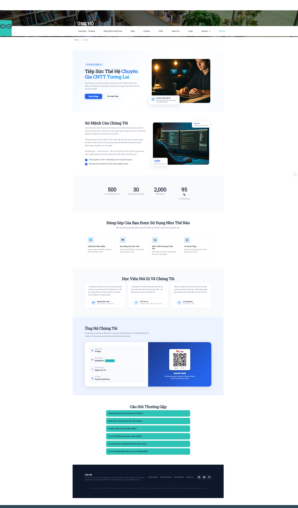
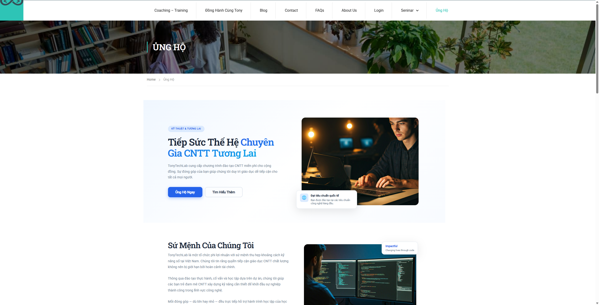
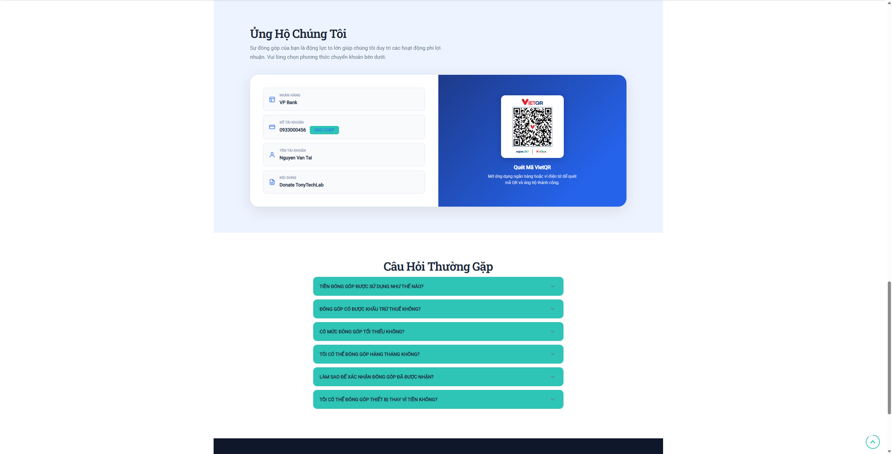

# TonyTechLab Donate Page — WordPress Plugin

A fully-configurable, accessible donation landing page plugin for WordPress with VietQR bank transfer and PayPal support.



## Features

- **8 Modular Sections**: Hero, Mission, Stats, Funds, Testimonials, Payment, FAQ, Footer
- **Two-Column Responsive Layout**: Modern design with images, badges, and floating cards
- **VietQR Integration**: Auto-generated QR code for Vietnamese bank transfers
- **PayPal Support**: Optional hosted PayPal donate button
- **Admin Settings Panel**: 9-tab admin UI — configure everything without code
- **Theme Agnostic**: Works with any WordPress theme via `[tonytechlab_donate]` shortcode
- **Single-Column Enforcement**: Automatically hides theme sidebars on the donate page
- **Scroll Reveal Animations**: Smooth entrance animations as users scroll
- **Accessible**: WCAG AA compliant with ARIA support
- **Progressive Enhancement**: Works without JavaScript
- **Bundled Images**: Includes professional stock photos as defaults

---

## Installation

### Method 1: Upload via WordPress Admin (Recommended)

1. Download the `tonytechlab-donate.zip` file from [Releases](https://github.com/tonytechlabvn/wp-donate/releases)
2. Go to **WordPress Admin > Plugins > Add New > Upload Plugin**
3. Click **Choose File**, select `tonytechlab-donate.zip`
4. Click **Install Now**
5. Click **Activate Plugin**


### Method 2: Manual Upload via FTP/SSH

1. Download and unzip the plugin
2. Upload the `tonytechlab-donate/` folder to `/wp-content/plugins/`
3. Go to **WordPress Admin > Plugins**
4. Find "TonyTechLab Donate Page" and click **Activate**

### Method 3: From GitHub

```bash
cd /path/to/wordpress/wp-content/plugins/
git clone https://github.com/tonytechlabvn/wp-donate.git tonytechlab-donate
```

Then activate via WordPress Admin.

---

## Quick Start

### Step 1: Create a Donate Page

1. Go to **WordPress Admin > Pages > Add New**
2. Give it a title (e.g., "Donate" or "Ủng Hộ")
3. Add the shortcode in the page content:
   ```
   [tonytechlab_donate]
   ```
4. Publish the page

### Step 2: Configure Payment Details

1. Go to **WordPress Admin > TonyTechLab Donate** (in the left sidebar)
2. Click the **Payment** tab
3. Fill in your bank details:
   - **Bank Name**: Your bank (e.g., "VIETCOMBANK (VCB)")
   - **Bank BIN Code**: VietQR identification number (find at vietqr.io)
   - **Account Number**: Your bank account number
   - **Account Holder**: Must match bank records (usually UPPERCASE)
   - **Transfer Note**: Default message for donors
4. Optionally add PayPal Hosted Button ID
5. Click **Save Changes**

### Step 3: Customize Content (Optional)

Each section has its own admin tab:

| Tab | What You Can Edit |
|-----|-------------------|
| **Hero** | Title, subtitle, tag text, CTA buttons, hero image URL, floating badge |
| **Mission** | Heading, paragraphs, bullet points, mission image URL, floating badges |
| **Stats** | Impact numbers (students, courses, hours, success rate) |
| **Funds** | How donations are used — icon, title, description, color per card |
| **Testimonials** | Student quotes, names, roles, avatar URLs |
| **Payment** | Bank details, PayPal ID, QR label and description |
| **FAQ** | Questions and answers (add/remove/reorder) |
| **Footer** | Brand name, disclaimer, social links, nav links |
| **Design** | Primary/secondary colors, font family |

---

## Admin Panel Overview

Access the settings at **WordPress Admin > TonyTechLab Donate**.

The admin panel has **9 tabs** across the top:

```
[ Hero ] [ Mission ] [ Stats ] [ Funds ] [ Testimonials ] [ Payment ] [ FAQ ] [ Footer ] [ Design ]
```

### Hero Tab
- **Tag Text**: Small badge above the title (e.g., "KỸ THUẬT & TƯƠNG LAI")
- **Headline**: Main hero title
- **Title Highlight**: Portion of the title rendered with gradient effect
- **Subtitle**: Supporting paragraph below the title
- **Primary CTA Text**: Main call-to-action button text
- **Secondary CTA Text**: Outline button text (leave empty to hide)
- **Hero Image URL**: Custom image URL (leave empty for bundled default)
- **Badge Title/Description**: Floating card overlaying the hero image

### Payment Tab
- **Bank Transfer**: Bank name, BIN code, account number, holder name, transfer note
- **PayPal**: Hosted button ID (leave as "YOUR_BUTTON_ID" to disable)
- **QR Label/Description**: Text shown next to the VietQR code

### Design Tab
- **Primary Color**: Main brand color (default: #2563eb — blue)
- **Secondary Color**: Accent color (default: #f59e0b — amber)
- **Font Family**: Choose from Inter, Roboto, Open Sans, Noto Sans, or System fonts

---

## Frontend Sections

### Hero
Two-column layout with text content on the left and an image with floating badge on the right.



### Mission
Organization's mission statement with bullet points and an image with overlay badges.

### Impact Stats
Four animated counters showing key metrics (students, courses, hours, success rate).

### Fund Allocation
Four colored cards showing how donations are distributed.

### Testimonials
Three cards with student quotes, avatars (auto-generated initials fallback), and roles.

### Payment
Two-tone card: white bank info fields on the left, blue gradient with VietQR code on the right.



### FAQ
Accordion-style with chevron icons. Click to expand/collapse answers.

### Footer
Horizontal layout with brand, navigation links, and social media icons.

---

## Customization

### Using Custom Images

Upload images to your WordPress Media Library, copy the URL, and paste it in the corresponding admin field:
- **Hero Tab > Hero Image URL**
- **Mission Tab > Mission Image URL**
- **Testimonials Tab > Avatar URL** (per testimonial)

If left empty, the plugin uses bundled professional stock photos.

### Custom Colors

Go to **Design Tab** and set:
- **Primary Color**: Used for buttons, links, accents
- **Secondary Color**: Used for highlights, hover states

### Adding/Removing FAQ Items

1. Go to **FAQ Tab**
2. Click **Add Item** to add a new Q&A
3. Click **Remove** on any item to delete it
4. Drag the handle (≡) to reorder

### Adding Social Links

1. Go to **Footer Tab > Social Links**
2. Click **Add Link**
3. Enter label (Facebook, YouTube, GitHub, etc.) and URL
4. Plugin auto-maps labels to SVG icons

---

## Technical Details

| Item | Detail |
|------|--------|
| **WordPress Version** | 5.0+ |
| **PHP Version** | 7.4+ |
| **Shortcode** | `[tonytechlab_donate]` |
| **Assets** | 1 CSS file, 1 JS file (vanilla, zero dependencies) |
| **Settings Storage** | `wp_options` table (9 option rows) |
| **Uninstall** | Cleans up all options from database |

### File Structure

```
tonytechlab-donate/
├── admin/
│   ├── admin-page.css          # Admin panel styles
│   ├── admin-repeater.js       # Repeater field JS
│   └── partials/               # 9 admin tab templates
├── includes/
│   ├── class-settings-manager.php    # Settings API + sanitization
│   ├── class-settings-renderer.php   # Admin page renderer
│   ├── class-shortcode-handler.php   # Shortcode + asset enqueueing
│   ├── default-settings.php          # Default values for all sections
│   └── helper-color-utils.php        # Color manipulation utilities
├── public/
│   ├── donate-page.css         # Frontend styles
│   ├── donate-page.js          # Frontend interactions
│   ├── images/                 # Bundled stock images
│   └── partials/               # 8 section templates
├── screenshots/                # UI screenshots
├── tonytechlab-donate.php      # Main plugin file
├── uninstall.php               # Cleanup on uninstall
└── README.md                   # This file
```

---

## License

GPL-2.0+

## Credits

Built by [TonyTechLab](https://tonytechlab.com)
